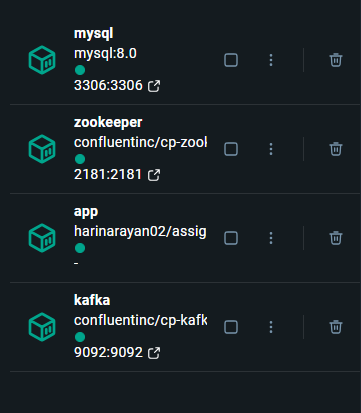

# Spartified Assignment

A Spring Boot application that processes **Call Detail Records (CDR)** using **Kafka** for message streaming and **PostgreSQL** for data persistence.  
The app consumes CDR messages from Kafka, deserializes them into Java objects, and stores them efficiently into the database using batch inserts.

---

## 🧩 Tech Stack

- **Backend:** Spring Boot 3.x
- **Message Broker:** Apache Kafka
- **Database:** PostgreSQL
- **ORM:** Spring Data JPA (Hibernate)
- **Build Tool:** Maven
- **Java Version:** 17+

---

## ⚙️ Project Setup

### 1. Clone the Repository
```bash
git clone https://github.com/R-Hari-Narayan/spartified-assignment.git
cd spartified-assignment
```

### 2. Run the docker compose file to stir up containers
```bash
docker-compose up
```



### 3. Run the Kafka container shell
```bash
docker exec -it kafka sh
```

### 4. Send CDR data to Kafka using Console Producer
```shell
cd ../../bin
kafka-console-producer --bootstrap-server localhost:9092 --topic cdr-topic
{"msisdn": "919812345678","dataVolumeBytes": 10240,"startDatetime": "2025-11-03T08:00:00Z","endDatetime": "2025-11-03T09:00:00Z","durationSeconds": 3600,"callType": "VOICE"}
```

### 5. Use a data file to bulk produce data
```shell
kafka-console-producer --bootstrap-server localhost:9092 --topic cdr-topic < cdr-data.csv
```